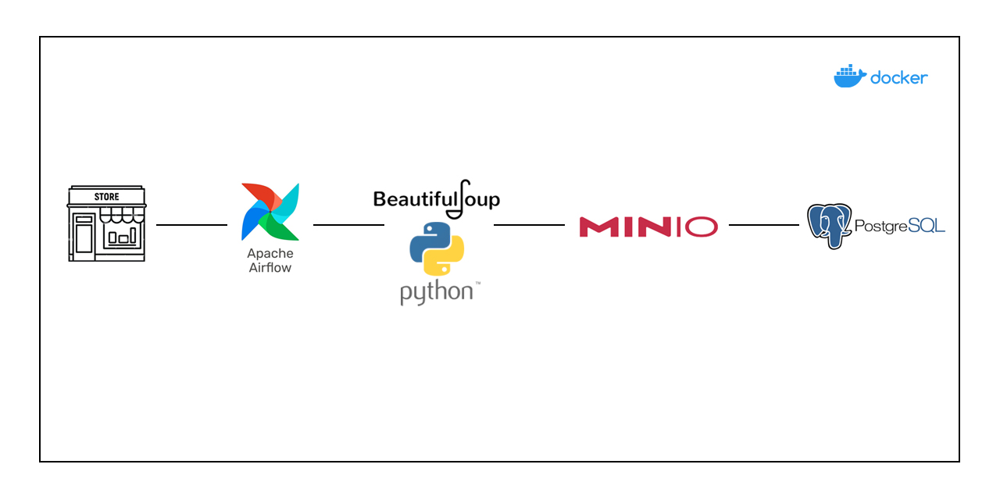

# Webscrapping-Airflow
## Обзор
#### Извлечение данных с сайта с товарами, очистка и хранение с использованием **BeautifulSoup**, **PostgreSQL**, **Apache Airflow**, **Minio** — все это организовано и упаковано в контейнеры с помощью **Docker Compose**.
_______
## Pipeline

_______
## Цель
#### Цель этого проекта — автоматизировать процесс сбора данных с веб-сайта конкурента и  сохранения в базе данных. Автоматизировав этот процесс, мы сможем сэкономить время и повысить точность за счёт устранения необходимости в ручном вводе данных.
______
## Создание виртуального окружения
```
python3.12 -m venv venv && \
source venv/bin/activate && \
pip install --upgrade pip && \
pip install -r requirements.txt
```
______
## Разворачивание инфраструктуры
```
docker-compose up -d
```
______
## ::Этичный веб-скрапинг
+ Соблюдайте правила robots.txt и Условия использования; избегайте запрещённых путей.
+ Внедряйте задержки/откаты, чтобы снизить нагрузку на серверы.
+ Собирайте только общедоступную, неперсональную информацию.